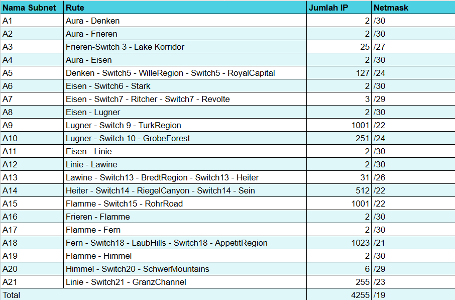
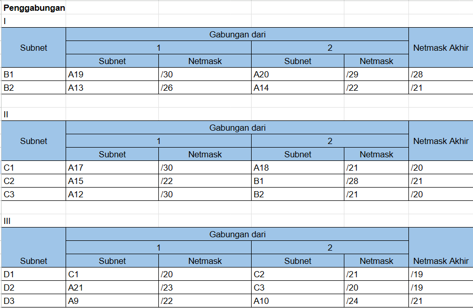
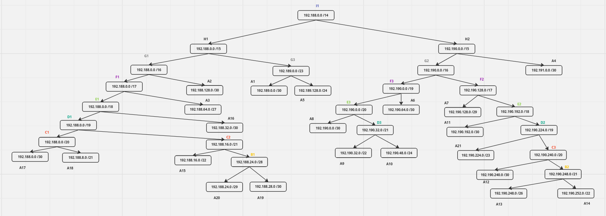
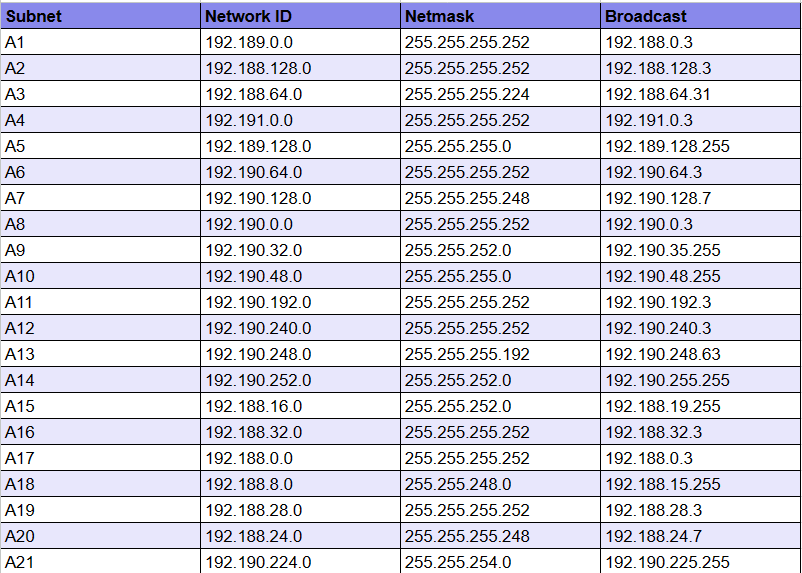

# Jarkom-Modul-4-B20-2023

Praktikum 4 Jarkom oleh Kelompok B20 (Richie Seputro dan Dimas Aria Pujangga)

# Topologi

# Rute

# VLSM Subnetting di Cisco Packet Tracer

Bagian Richie

# VLSM Routing di Cisco Packet Tracer

Bagian Richie
(Masukkan video demonstrasi ping antar client)

# CIDR Subnetting di GNS 3

CIDR (Classless Inter-Domain Routing) adalah metode pengalamatan IP yang menggantikan metode pengalamatan kelas tradisional dalam protokol IPv4. CIDR memungkinkan pembagian subnet secara fleksibel dalam IPv4, yang membantu dalam penggunaan alamat IP yang efisien dan pengelompokan jaringan yang lebih baik.

Sebelum CIDR, alamat IP dibagi menjadi kelas A, B, dan C. Kelas A memiliki 8 bit pengidentifikasi jaringan dan 24 bit pengidentifikasi host, kelas B memiliki 16 bit pengidentifikasi jaringan dan 16 bit pengidentifikasi host, dan kelas C memiliki 24 bit pengidentifikasi jaringan dan 8 bit pengidentifikasi host.

Sistem pengalamatan kelas ini memiliki beberapa kelemahan. Misalnya, kelas A dapat mendukung hingga 16 juta host, tetapi banyak organisasi tidak memerlukan jumlah host sebanyak itu. Akibatnya, sebagian besar alamat kelas A tidak digunakan.

CIDR mengatasi kelemahan ini dengan memungkinkan organisasi untuk mengalokasikan jumlah bit pengidentifikasi jaringan yang mereka butuhkan. Misalnya, organisasi dengan 100 host dapat mengalokasikan 16 bit pengidentifikasi jaringan, yang memungkinkan mereka untuk menggunakan alamat kelas C.

Notasi CIDR digunakan untuk mewakili alamat IP dan jumlah bit pengidentifikasi jaringan. Notasi ini terdiri dari alamat IP diikuti oleh tanda garis miring (/) dan jumlah bit pengidentifikasi jaringan. Misalnya, alamat IP 192.168.1.0 dengan 22 bit pengidentifikasi jaringan direpresentasikan sebagai 192.168.1.0/22.

# Penggabungan Node

.png)

.png)

# Tree

Setelah dilakukannya penggabungan IP, sekarang kita melakukan pembagian IP dengan menggunakan tree pada masing-masing kelompok yang telah dibuat sebelumnya sebagai berikut.

# Pembagian IP

Berikut merupakan hasil dari pembagian IP berdasarkan Tree yang telah dibuat sebelumnya.

# CIDR Routing di GNS 3

Bagian Dimas
(Masukkan video demonstrasi ping antar client)
